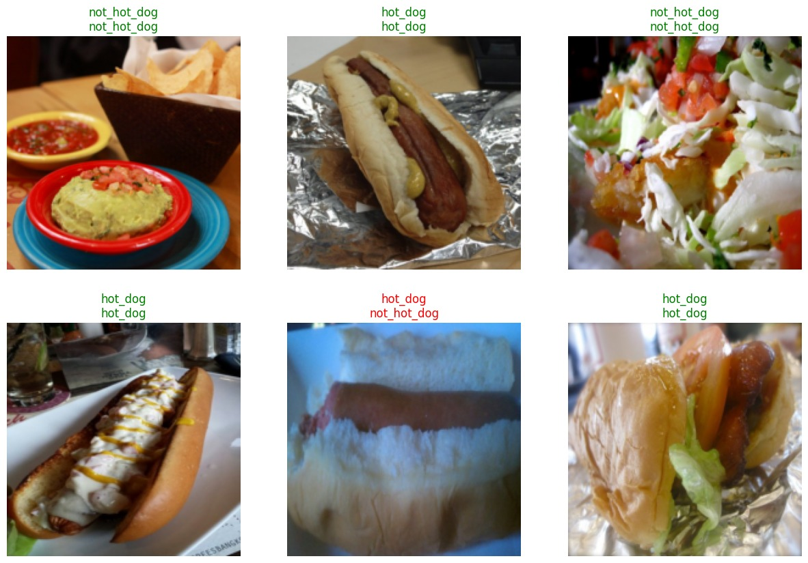

# Hot Dog or Not Hot Dog 🌭

> "I can only do hot dog, not hot dog. Nothing else."

[HuggingFace Model](https://huggingface.co/spaces/habuTusk/seefood)

This recreates Jian-Yang's "Not Hotdog" app from [Silicon Valley Season 4](https://www.youtube.com/watch?v=tWwCK95X6go), where the character builds a simple binary classifier that can only identify hot dogs.



## How it was trained

It uses a fine-tuned ResNet50 convolutional neural network built with FastAI to distinguish between hot dog and not hot dog images. Check Hot_Dog_or_Not_Hot_Dog.ipynb for detailes

**Architecture:**
- Pre-trained ResNet50 model
- Transfer learning with 20 epochs of fine-tuning
- Binary classification (hot dog vs not hot dog)
- 224x224 pixel image input with data augmentation
- Includes data cleaning workflow with ImageClassifierCleaner

**Training Process:**
1. Downloads Hot Dog dataset from Kaggle
2. Creates DataLoaders with 80/20 train/validation split
3. Applies data augmentation (random crops, transforms)
4. Fine-tunes ResNet50 for 20 epochs
5. Evaluates with confusion matrix and top losses
6. Provides data cleaning interface
7. Exports trained model as `model.pkl`

## Installation

- Install [Mambaforge](https://github.com/conda-forge/miniforge#mambaforge) or [Miniconda](https://docs.conda.io/en/latest/miniconda.html)

1. Clone this repository:
```bash
git clone https://github.com/krjadhav/hot_dog_or_not_hot_dog.git
cd seefood
```

2. Create and activate the conda environment:
```bash
mamba env create -f environment.yml
mamba activate seefood
```

3. Run the application:
```bash
python app.py
```

The Gradio interface will launch and be available at `http://localhost:7860`

## Files
- `app.py` - Main Gradio application
- `model.pkl` - Pre-trained FastAI model
- `environment.yml` - Conda environment specification
- `hot_dog.jpg` - Example hotdog image
- `not_hotdog.jpg` - Example non-hotdog image

## Usage
1. Upload an image or select from the examples
2. The model will classify it as either "hotdog" or "not_hotdog"
3. View the confidence scores for each category
